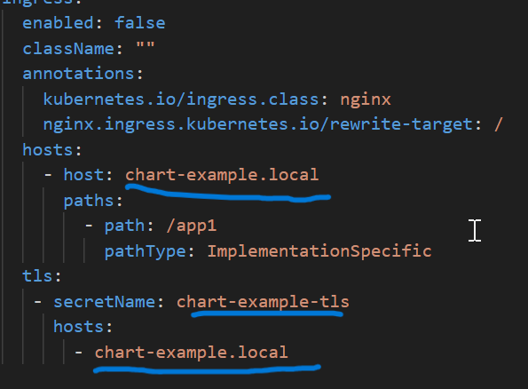

*This is the simple test-task*

## Main goal

Main goal was to create two nginx endponts and ingress to access them

## Statement of the problem

Deploy two applications (app1 and app2) in a common 'api' namespace. Each application should be deployed using a Deployment and a Service and accessible via the appropriate routes through the NGINX Ingress Controller.

#### Steps:

1. Deploy and configure a Kubernetes cluster on Ubuntu 24.
2. Create two deployments app1 and app2, each with two replicas, and configure them to serve different pages.
3. Configure an Ingress Controller to route requests to the applications:
   /app1 -> app1:80 for HTTP/HTTPS (80, 443).
   /app2 -> app2:80 for HTTP/HTTPS (80, 443).
4. Optional:
   Add a ConfigMap to configure app1 and app2 settings.

## Requirements

Kubernetes cluster on a node running Ubuntu (24).

Helm package manager: https://helm.sh/

## Execution steps

create namespace

```bash
kubectl create namespace api
```

(don't forget to switch namespace e.g.

```bash
kubens <namespace_name>
```

command about kubens: https://github.com/ahmetb/kubectx)

clone this repo

```bash
  git clone https://github.com/TimaevAlexandr/test.git && cd test
```

change (based on your configuration host and tls secret for ingress)

./app1/values : hosts/-host

also do this trick with

 ./app2/values



install helm chart

```bash
helm install app1 app1 -n api --values common-settings.yml
helm install app2 app2 -n api --values common-settings.yml
```

happy helming ^_^

now you can visit this pages. Fantastic!

http://<you_host>/app1

http://<you_host>/app2

or with tls

https://<you_host>/app1

https://<you_host>/app1
